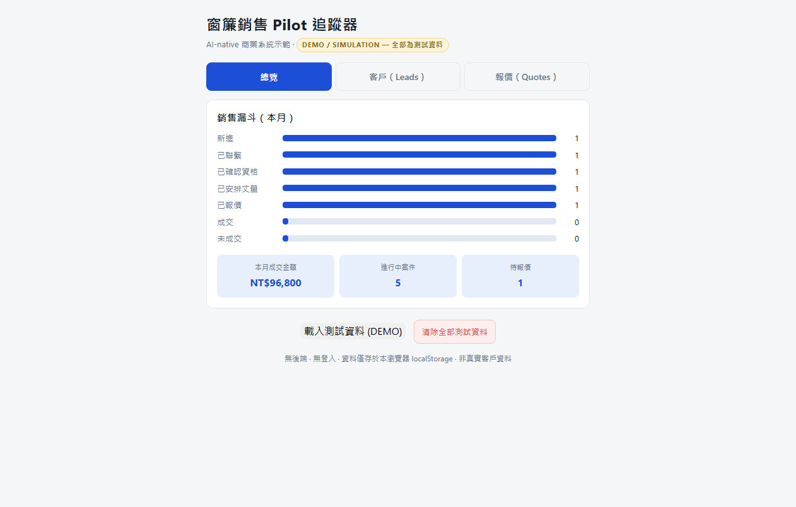

# Sales Pilot Tracker — DEMO

> **A Paul + AI collaboration prototype** · vanilla HTML/CSS/JS · zero dependencies · localStorage only
> All data is **DEMO / SIMULATION** — no real customers, no real revenue, no backend.

## ▶️ Live demo

**https://apchen1978.github.io/curtain-sales-pilot-demo/**



Load 測試資料 (DEMO) and drive the pipeline yourself: advance leads, create versioned quotes,
hit **負責人核准**, and watch the approval gate unlock "已報價".

A runnable web demo of the core of a small-business **sales-pilot tracker**, re-implemented here
as a dependency-free, clone-and-run showcase.

## Why this repo exists

This demo shows the *discipline* that makes a business system useful for a real business — not a
toy CRUD app:

1. **Lead pipeline with explicit rules** — `new → contacted → qualified → measurement_booked → quoted → won | lost`
2. **UNKNOWN stays UNKNOWN** — missing facts (budget, area, requirements) are displayed as
   `UNKNOWN`, **never fabricated or defaulted**. A sales system that invents data is worse than
   one that says "we don't know".
3. **Quote versioning** — every quote is a version (v1, v2, …); a quote only counts as "quoted"
   after **decision-maker approval** (a human gate). Approval ≠ execution; the UI enforces the order.
4. **Actionable next step on every lead** — the system tells the operator what to do next
   ("24h 內首次聯繫", "安排丈量", "等待負責人核准報價").

These rules came from real operating conventions (24h first contact, measurement-before-quoting,
approval-before-price). A portfolio repo should show *judgment*, not just code.

## Architecture (deliberately minimal)

| File | Role |
|---|---|
| `index.html` | Single-page UI: Dashboard / Leads / Quotes tabs |
| `app.js` | State, localStorage, **rules engine** (pipeline transitions, quote approval gate), rendering |
| `styles.css` | Mobile-first, touch-friendly, no frameworks |

- Zero dependencies, zero build step — **double-click `index.html` or serve the folder**.
- No absolute paths anywhere; copy the folder = installed.
- All user input rendered via `textContent` (XSS-safe).

## How to run

```bash
# option A: just open index.html in a browser
# option B: any static server
python -m http.server 8080     # then open http://localhost:8080
```

Load 測試資料 (DEMO) to seed five fake leads + one approved quote, then drive the pipeline:
advance a lead → create quotes → **負責人核准** → watch it unlock "已報價" → 標記成交.

## Verification (2026-08-18)

Functional checks (automated browser run, all PASS):
- Seed → 5 leads + 1 approved quote render; funnel counts correct
- Add lead → appears as `new` with "24h 內首次聯繫" next action
- Advance pipeline; `quoted` is **blocked until an approved quote exists** (rule enforced)
- Create quote v1 → draft; approve → `quoted` unlocks; second quote becomes v2
- UNKNOWN chips render for missing budget/area; no fabricated values
- localStorage persistence across reload; clear-all works; XSS-safe

## Design principles

- **Zero dependencies, relative paths** — copy the folder and it runs.
- **Honest UNKNOWNs** — missing facts stay visible instead of being filled in.
- **Verification evidence** — the functional checks above are part of the deliverable.

## Privacy & data

- No backend, no login, no external API, no analytics. Data lives in this browser's
  `localStorage` only.
- Everything is fake: names, areas, budgets, quotes. Nothing here is a real customer or real money.

## License / reuse

Free to read, run, and learn from. Contact me if you want to build something like this for your
own business.
